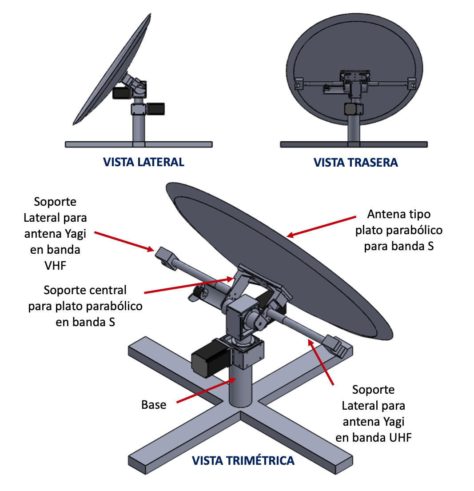
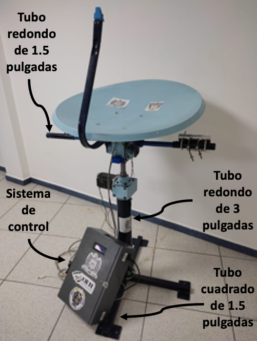
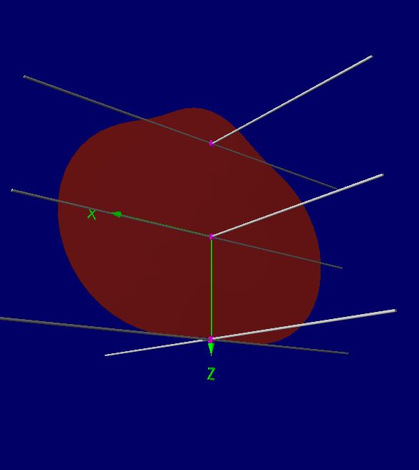
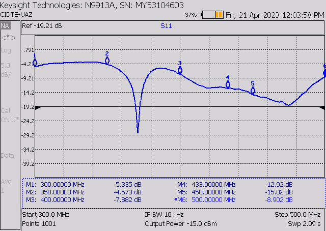
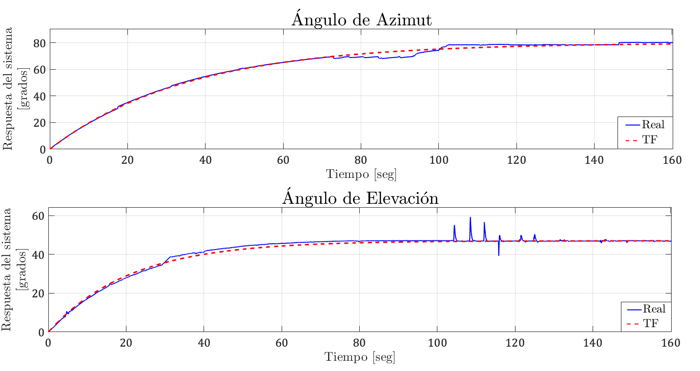
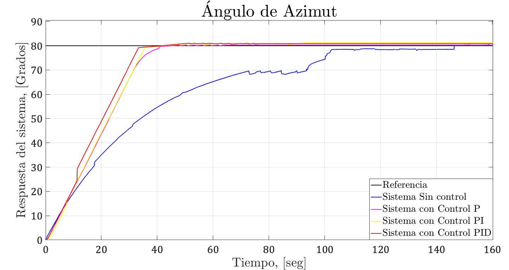
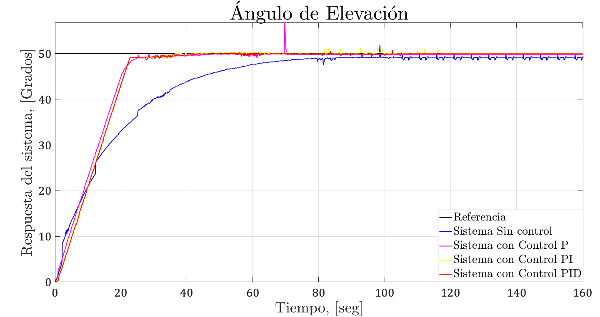

# An IoT Ground Station: Mechanics, Control, Antenna, and Reception from a LoRa SatelliteNetwork

Se presentan los recursos y la documentación adicional obtenidos como resultado por el desarrollo del manuscrito "An IoT Ground Station: Mechanics, Control, Antenna, and Reception from a LoRa Satellite Network" publicado en IEEE Latin America Transactions. Esta información se organiza en tres carpetas: 

1. Antena, donde podrá observar los archivos del diseño y simulación de este dispositivo.

   a) El archivo Turstile.s1p es un archivo generado por un analizador vectorial redes (VNA) que contiene el parámetro S de 1 puerto (S11) medido en el laboratorio.
   
   b) El archivo turstile.nec es un archivo generado en el software libre 4NEC2 para simulación de la antena. El software puede ser descargado en:https://www.qsl.net/4nec2/.
   
2. Sistema Mecánico, aquí se encuentran los archivos de diseño y los planos para poder fabricar cada una de las piezas que conforman al sistema mecánico.
3. PID, en esta carpeta se encuentra  el código de programación del controlador PID discreto utilizado para manipular las articulaciones. Para ello, se utilizó la plataforma de Arduinoal debido a que se utilizó una placa de esta marca.

## Requerimientos
 
- Sistema operativo Windows.
- Microsoft Excel.
- Matlab 2018 o posteriores con el “RF Toolbox” instalado.
- Última versión de 4NEC2.
- SolidWorks 2018 o posteriores.
- Plataforma de Arduino.

## Imagenes

  
  
  
  
 
  
  

## Instrucciones

1.a) Las mediciones incluidas en el archivo Turstile.s1p pueden ser visualizadas con solo arrástralo a una nueva hoja de Excel. Ya en Excel se pueden observar tres columnas correspondientes al barrido de frecuencia, la magnitud del parámetro S11 (coeficiente de reflexión en dB) y su fase. Con ello se pueden obtener graficas tanto de magnitud y fase de S11 vs frecuencia. Las mediciones contenidas en el archivo archivo puede ser también observadas en alguna reciente versión de Matlab con el de “RF Toolbox” instalado. Se escribe un m-file en el “Editor” para graficar el parámetro S11 en dB de la siguiente forma:

S=sparameters(“Turnstile.s1p”);
rfplot(S)

Si desean graficar otros parámetros de la antena como carta de Smith, VWR o impedancia, cheque la ayuda con en la ventana “Comand Window” tecleando:

help rfplot

1.b) El archivo turstile.nec se abre en la venta “Main” en la opción “Open 4NEC2 in/out file”. Este archivo ya hecho a modo para la antena utilizada permite observar los parámetros de antena simulados como los dependientes de la frecuencia como S11 en dB, VWR, impedancia, etc. Para más información del uso de 4NEC2, vea los siguientes videos en YouTube:

- https://www.youtube.com/watch?v=vaLx3_F6-b4
- https://www.youtube.com/watch?v=T5hyCiytaFk

2. Se comparten los archivos de los planos en formato PDF de manera que puedan utilizarlos para fabricar y reproducir cada una de las piezas mecánicas. Así también, los archivos en formato SLDPRT los cuales pueden abrir mediante SOLIDWORKS para que puedan realizar los cambios en el diseño conforme a sus requerimientos.
3. Para el control de las articulaciones, se utilizó una tarjeta de tipo ARDUINO, por lo que, el archivo del código del controlador PID esta en etse formato.
